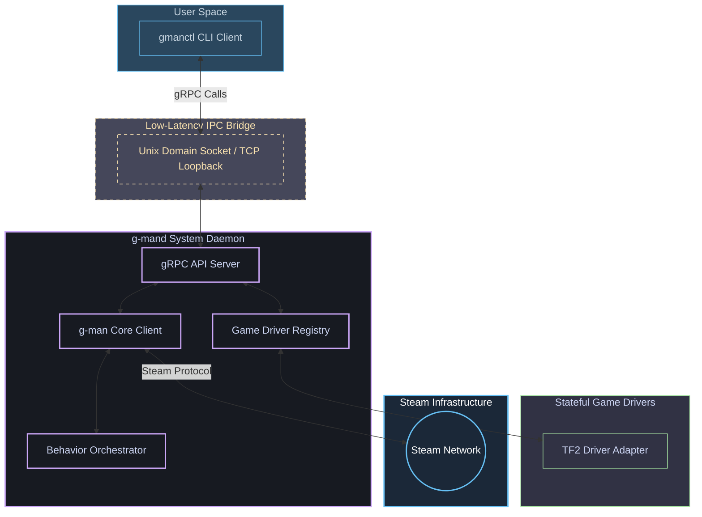

<div align="center">

# ⚙️ G-MAN CLI

### Background Daemon & Styled CLI Client for the G-MAN Framework

[](https://pkg.go.dev/github.com/lemon4ksan/g-man-cli)
[](LICENSE)
[](https://github.com/lemon4ksan/g-man-cli/stargazers)

> _"Time, Dr. Freeman? Is it really that time again?"_

#### 🇺🇸 [English](README.md) • 🇷🇺 [Русский](README_RU.md)

</div>

**G-man CLI** is the official system control toolchain and daemon suite for **G-man** Steam automation pipelines. Consisting of a high-performance background daemon (`g-mand`) and a styled, color-coded command-line client (`gmanctl`), it provides industrial-scale operations management, multi-game coordination, and direct inventory control over secure, low-latency gRPC channels.

## 🛠 Architecture Overview

The toolchain operates under a strict client-server model over a local IPC channel. The daemon holds stateful CM connection sessions and automatically synchronizes with active game modules, while the CLI client acts as a stateless, lightweight trigger:



## ⚡ Key Features

### 📡 Low-Latency gRPC IPC Channels
Fast, protocol-agnostic, and platform-optimized. Communication between `gmanctl` and `g-mand` is established over **gRPC**:
* **Linux / macOS**: High-throughput **Unix Domain Sockets (UDS)** located at `~/.config/gman/gman.sock`.
* **Windows**: Ultra-fast **TCP loopback** on port `127.0.0.1:50051`.

### 🔄 Fully Reactive Presence Sync
No state mismatch. The daemon automatically listens to the core Steam client's Event Bus for `apps.AppLaunchedEvent` and `apps.AppQuitEvent`. If a game session is auto-started or quit in the background by another automation module (e.g., to load inventory cache on start), `g-mand` immediately catches the event, updates its internal state, and spins up the respective Game Coordinator driver.

### 🧹 Real-Time OS Garbage Reclaiming (`gc` Command)
Keep your daemon running for months. By sending the `gc` command, `g-mand` triggers Go's internal garbage collection (`runtime.GC()`) followed by an immediate physical memory reclaim (`debug.FreeOSMemory()`). This instantly flushes temporary JSON schema parsing allocations and returns unused RAM directly to the Host OS.

### 🎮 Extensible Multi-Game Driver Registry
Built around a clean `Driver` and `InventoryProvider` abstract package structure. You can write custom, state-isolated drivers for any Steam game. G-man CLI ships out-of-the-box with a high-performance **Team Fortress 2 adapter** implementing:
* **Manual Crafting Manager:** Fast scrap/reclaimed/refined metal conversions.
* **Smart Item Positioning:** Structured terminal layouts indicating pages and slot locations.
* **Auto-Acknowledge:** Batch confirmation of newly acquired item drops.

## 📂 Project Directory Structure

```text
g-man-cli/
├── cmd/
│   ├── g-mand/          # System background service managing CM and GC connections
│   └── gmanctl/         # Stateless, styled CLI client for system control
├── pkg/
│   ├── game/            # Abstract game driver contracts & registries
│   │   ├── driver.go    # Unified Driver & InventoryProvider interfaces
│   │   ├── registry.go  # Thread-safe registered game drivers collection
│   │   └── tf2.go       # Team Fortress 2 Driver wrapping g-man-tf2 extension
│   ├── tf2/             # Specialized TF2 backpack layouts and custom commands
│   └── protobuf/        # Structurally-typed gRPC schema specifications
│       └── daemon/      # Protobuf files and compiled Go code generators
└── Makefile             # Automation suite (proto compile, binary build, unit tests)
```

## 🚀 Getting Started

### 1. Build Binaries
Build the executable binaries into the `bin/` directory:
```shell
make build
```

### 2. Launch the System Daemon
Start the background daemon. You must supply your Steam credentials via environment variables:
```powershell
# In PowerShell:
$env:STEAM_USER="your_steam_username"
$env:STEAM_PASS="your_steam_password"

# Launch daemon
.\bin\g-mand.exe
```

### 3. Control via CLI Client
Open a separate terminal window and issue command sequences to the active daemon:

* **Query Daemon Health & Metrics:**
  ```shell
  .\bin\gmanctl.exe status
  ```
* **Forcibly Free OS Memory (GC):**
  ```shell
  .\bin\gmanctl.exe gc
  ```
* **Play Team Fortress 2 (Initializes GC Driver):**
  ```shell
  .\bin\gmanctl.exe play 440
  ```
* **Query TF2 Backpack Inventory Table:**
  ```shell
  .\bin\gmanctl.exe exec 440 inventory
  ```
* **Smelt Metal (Combines Scrap/Reclaimed):**
  ```shell
  .\bin\gmanctl.exe exec 440 craft-metal type=reclaimed
  ```
* **Return Bot to Simple Online Status (Exit Game):**
  ```shell
  .\bin\gmanctl.exe exit-game
  ```
* **Manage Steam Guard (TOTP / Confirmations):**
  ```shell
  # Check configuration status
  .\bin\gmanctl.exe guard status
  # Generate current 2FA TOTP code
  .\bin\gmanctl.exe guard code
  # List pending mobile confirmations
  .\bin\gmanctl.exe guard list
  # Accept or decline confirmation by ID
  .\bin\gmanctl.exe guard respond <confirmation_id> accept
  # Import Steam Guard secrets configuration
  .\bin\gmanctl.exe guard import <shared_secret> <identity_secret> <device_id> [account_name]
  ```
* **Gracefully Shut Down Daemon:**
  ```shell
  .\bin\gmanctl.exe stop
  ```

## ⚙️ Compilation & Development
The project includes a unified automation pipeline via `Makefile`.

* **Regenerate gRPC Protobuf Go Files:**
  ```shell
  make proto
  ```
* **Run Unit Tests:**
  ```shell
  make test
  ```
* **Remove Build Artifacts:**
  ```shell
  make clean
  ```

## ⚖️ Legal & License

**Disclaimer:** This software is **not** affiliated with, maintained by, or endorsed by **Valve Corporation** or any of its subsidiaries. Steam and all related Valve properties are registered trademarks of Valve Corporation. Use of this library is at your own risk.

This project is licensed under the **BSD 3-Clause License**. See [LICENSE](LICENSE) for full details.
