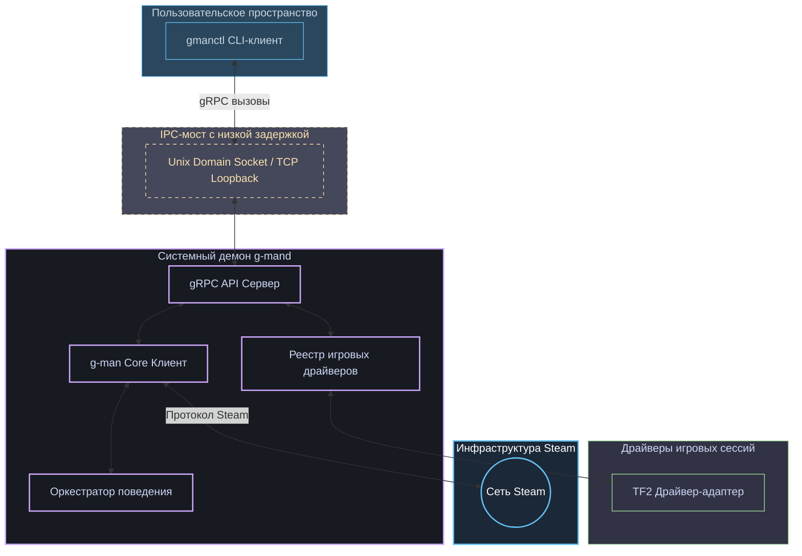

<div align="center">

# ⚙️ G-MAN CLI

### Фоновый демон промышленного класса и стильный CLI-клиент для фреймворка G-MAN

[](https://pkg.go.dev/github.com/lemon4ksan/g-man-cli)
[](LICENSE)
[](https://github.com/lemon4ksan/g-man-cli/stargazers)

> _"Время, доктор Фримен? Неужели снова пришло то самое время?"_

#### 🇺🇸 [English](README.md) • 🇷🇺 [Русский](README_RU.md)

</div>

**G-man CLI** — это официальный системный инструментарий управления и фоновый сервис для автоматизации процессов в Steam на базе фреймворка **G-man**. Состоящий из высокопроизводительного демона (`g-mand`) и консольного клиента (`gmanctl`), проект обеспечивает надежное управление операциями, координацию нескольких игр и прямой контроль над инвентарем через защищенные IPC-каналы gRPC с низкой задержкой.

## 🛠 Обзор архитектуры

Инструментарий построен на классической клиент-серверной модели взаимодействия через локальный IPC-канал. Демон удерживает постоянные сетевые сессии Steam (Connection Manager) и автоматически синхронизируется с игровыми модулями, тогда как CLI-клиент выступает в роли легковесного stateless-триггера команд:



## ⚡ Ключевые особенности

### 📡 Высокопроизводительные IPC-каналы gRPC
Быстрое межпроцессное взаимодействие без лишних накладных расходов. Соединение между `gmanctl` и `g-mand` оптимизировано под конкретную операционную систему:
* **Linux / macOS**: Производительные сокеты **Unix Domain Sockets (UDS)** по пути `~/.config/gman/gman.sock`.
* **Windows**: Высокоскоростной **TCP-петлевой интерфейс (loopback)** на порту `127.0.0.1:50051`.

### 🔄 Полностью реактивная синхронизация статуса
Исключает рассинхронизацию состояний. Демон напрямую подписывается на события `apps.AppLaunchedEvent` и `apps.AppQuitEvent` системной шины ядра Steam-клиента. Если запуск или остановка игры происходит автоматически в фоновом режиме по инициативе любого другого модуля ядра (например, для загрузки кеша предметов), `g-mand` мгновенно регистрирует это событие, обновляет внутреннее состояние и запускает соответствующий игровой координатор (GC).

### 🧹 Принудительная очистка физической памяти (`gc`)
Гарантия стабильной многомесячной работы демона. Команда `gc` отправляет запрос демону на запуск принудительного цикла сборки мусора (`runtime.GC()`) с последующим немедленным освобождением памяти на системном уровне (`debug.FreeOSMemory()`). Это мгновенно очищает временные аллокации (например, после парсинга тяжелой схемы предметов TF2) и возвращает физическую RAM хост-системе.

### 🎮 Расширяемый реестр игровых драйверов
Построен вокруг строгого абстрактного контракта `Driver` и `InventoryProvider` в пакете `pkg/game`. Вы можете легко добавлять драйверы для любых других игр. "Из коробки" G-man CLI поставляется с **драйвером для Team Fortress 2**, реализующим:
* **Интегрированный менеджер крафта:** Автоматическое или ручное слияние металлолома/восстановленного металла в очищенный.
* **Сетка позиционирования:** Форматированная таблица рюкзака с указанием страниц и точных слотов предметов.
* **Групповое подтверждение:** Пакетное подтверждение получения новых предметов из игровых дропов.

## 📂 Структура каталогов проекта

```text
g-man-cli/
├── cmd/
│   ├── g-mand/          # Фоновая служба, управляющая подключениями к Steam CM и GC
│   └── gmanctl/         # Консольный stateless-клиент управления с цветным выводом
├── pkg/
│   ├── game/            # Контракты и реестр игровых драйверов
│   │   ├── driver.go    # Общие интерфейсы Driver и InventoryProvider
│   │   ├── registry.go  # Потокобезопасная коллекция зарегистрированных драйверов
│   │   └── tf2.go       # Адаптер драйвера TF2 для взаимодействия с модулем g-man-tf2
│   ├── tf2/             # Логика генерации таблиц рюкзака и кастомных действий TF2
│   └── protobuf/        # Строго типизированные gRPC-контракты
│       └── daemon/      # Protobuf-файлы схемы и сгенерированный Go-код
└── Makefile             # Автоматизация сборки, генерации кода и тестирования
```

## 🚀 Быстрый старт

### 1. Сборка исполняемых файлов
Скомпилируйте бинарные файлы демона и клиента в каталог `bin/`:
```shell
make build
```

### 2. Запуск системного демона
Запустите фоновую службу, предварительно передав учетные данные Steam через переменные окружения:
```powershell
# В PowerShell на Windows:
$env:STEAM_USER="ваш_логин_steam"
$env:STEAM_PASS="ваш_пароль_steam"

# Запуск демона
.\bin\g-mand.exe
```

### 3. Управление через CLI-клиент
Откройте соседнее окно терминала и отправляйте команды запущенному демону:

* **Проверить показатели здоровья и метрики демона:**
  ```shell
  .\bin\gmanctl.exe status
  ```
* **Принудительно очистить системную память (GC):**
  ```shell
  .\bin\gmanctl.exe gc
  ```
* **Запустить игровую сессию TF2 (активирует GC-драйвер):**
  ```shell
  .\bin\gmanctl.exe play 440
  ```
* **Вывести таблицу инвентаря рюкзака TF2 в консоль:**
  ```shell
  .\bin\gmanctl.exe exec 440 inventory
  ```
* **Объединить металл (крафт восстановленного металла):**
  ```shell
  .\bin\gmanctl.exe exec 440 craft-metal type=reclaimed
  ```
* **Вернуть бота в простой статус "В сети" (выход из игры):**
  ```shell
  .\bin\gmanctl.exe exit-game
  ```
* **Управление Steam Guard (2FA TOTP / Подтверждения):**
  ```shell
  # Проверить статус конфигурации Guard
  .\bin\gmanctl.exe guard status
  # Сгенерировать текущий временный код 2FA TOTP
  .\bin\gmanctl.exe guard code
  # Получить список ожидающих мобильных подтверждений
  .\bin\gmanctl.exe guard list
  # Подтвердить или отклонить мобильную транзакцию по ID
  .\bin\gmanctl.exe guard respond <confirmation_id> accept
  # Импортировать секреты авторизации Steam Guard
  .\bin\gmanctl.exe guard import <shared_secret> <identity_secret> <device_id> [account_name]
  ```
* **Корректно остановить фоновый процесс демона:**
  ```shell
  .\bin\gmanctl.exe stop
  ```

## 🐳 Развертывание в Docker

Для удобства развертывания и изоляции в репозитории подготовлены Dockerfile для демона и клиента.

### 1. Добавление в `docker-compose.yml`

Вы можете запускать демон `g-mand` в связке с другими вашими сервисами. Пример конфигурации:

```yaml
services:
  g-man:
    build:
      context: .
      dockerfile: cmd/g-mand/Dockerfile
    container_name: g-mand
    restart: unless-stopped
    environment:
      - GMAN_CONTAINER=true
      - STEAM_USER=${STEAM_USER}
      - STEAM_PASS=${STEAM_PASS}
      - STEAM_REFRESH_TOKEN=${STEAM_REFRESH_TOKEN}
    volumes:
      - gman-data:/app/data

  gmanctl:
    build:
      context: .
      dockerfile: cmd/gmanctl/Dockerfile
    container_name: g-man-ctl
    entrypoint: ["tail", "-f", "/dev/null"]
    environment:
      - GMAN_CONTAINER=true
      - GMAN_IPC_ADDR=/app/data/gman.sock
    volumes:
      - gman-data:/app/data
    depends_on:
      - g-man
    # Выполнить команду: docker compose exec g-man-ctl ./gmanctl status

volumes:
  gman-data:
```

> [!IMPORTANT]
> Создайте `.env` файл с вашими учетными данными Steam перед запуском:
> ```bash
> STEAM_USER=your_username
> STEAM_PASS=your_password
> STEAM_REFRESH_TOKEN=your_token
> ```

### 2. Запуск и модерирование через CLI

```bash
# Start daemon
docker compose up -d g-man

# Check status
docker compose run --rm gmanctl status

# Stop daemon
docker compose run --rm gmanctl stop
```

## ⚙️ Компиляция и разработка
Вся автоматизация рутинных процессов разработки описана в едином `Makefile`.

* **Перегенерировать Go-файлы gRPC из Protobuf-схемы:**
  ```shell
  make proto
  ```
* **Запустить юнит-тесты:**
  ```shell
  make test
  ```
* **Удалить собранные бинарные файлы:**
  ```shell
  make clean
  ```

## ⚖️ Лицензия и правовая информация

**Дисклеймер:** Это программное обеспечение **не** связано с корпорацией **Valve Corporation**, не поддерживается и не одобряется ею. Steam и все связанные свойства Valve являются зарегистрированными товарными знаками Valve Corporation. Использование данной библиотеки осуществляется исключительно на ваш собственный риск.

Проект распространяется под лицензией **BSD 3-Clause License**. Полный текст лицензии см. в файле [LICENSE](LICENSE).
